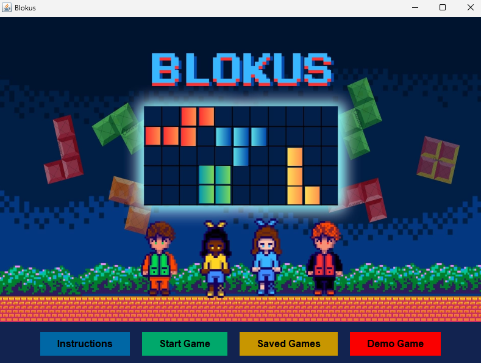
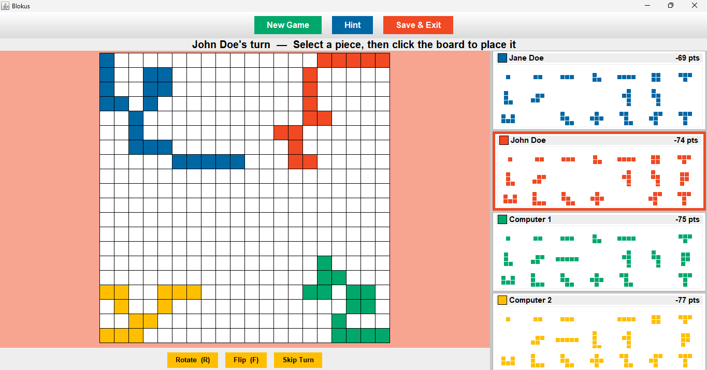

# Blokus

A Java implementation of the classic Blokus strategy board game, developed as a
group project by a team of 4 computer science students.

## Screenshots



## About
Blokus is a strategy board game where 2–4 players take turns placing pieces on
a shared board. Each piece placed must touch at least one other piece of the
same colour, but only at the corners — never along the edges. The goal is to
place as many of your pieces as possible while blocking your opponents.

## Features
- 2–4 player support
- Graphical (GUI) interface
- Full Blokus rule enforcement
- Interactive piece placement
- Save and load game functionality
- In-game hint functionality
- Computer player with two difficulty modes:
  - **Easy** — randomly selects a valid piece to place
  - **Hard** — prioritises placing the largest pieces first and works towards
    the centre of the board to block opponents from securing key positions

## Screenshots



## How to Run
Requires Java (JDK 8 or higher)

**Option 1 – Double-click** the `Blokus.jar` file if your system supports it.

**Option 2 – Run from terminal:**
```bash
java -jar Blokus.jar
```

## Technologies Used
- Java
- Java Swing / AWT
- Java Serialisation (for save/load functionality)

## Team
This project was developed and presented by a team of 4 students.
Individual contributions:
- **Lynette Nzanza** — Game UI design, core game logic, save/load system using
  Java serialisation, and co-development of the computer player algorithm

## Note
Source code is not publicly available. The compiled JAR is provided for
demonstration and portfolio purposes only.
